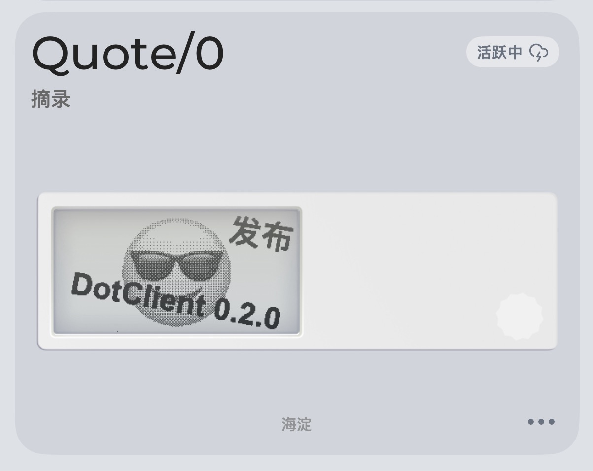
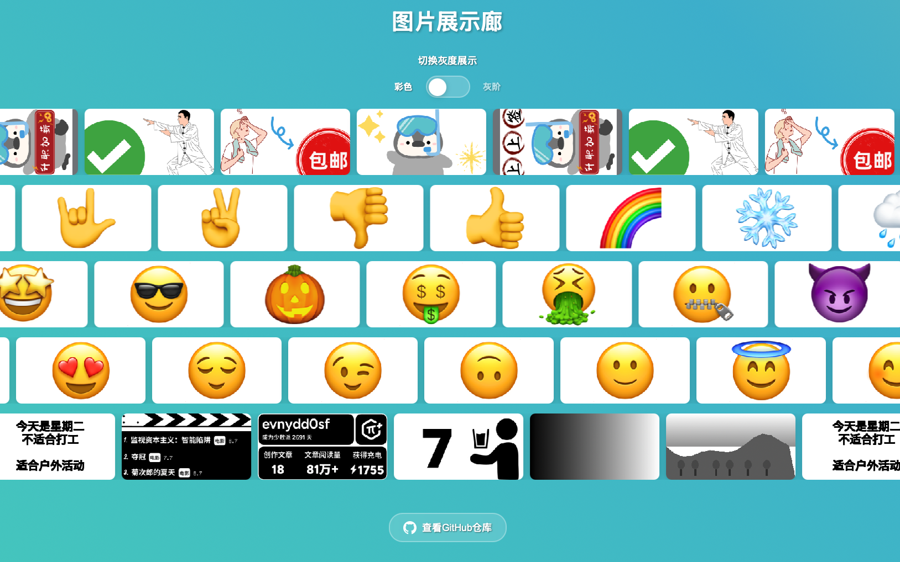

# DotClient客户端

针对Dot.开发的墨水屏推送软件，定制自己的文本和图案

  

## 主要功能

 - 调用dot.的文本、图片api配置内容，图片支持灰阶转换，让黑白墨水屏显示灰度的效果
 - 通过制图页面自由定制文本的样式，包括大小、旋转、emoji等
 - 配置的图片或者制作的图片，可以导出文件分享
 - 多个示例icon，示例图片可以选择
 - 配置多个设备，选择制定设备发送
 - 添加了base64转换工具，可以把图片转换成base64

**示例图片**

  

**软件示例**

  

**安装**

目前支持window，mac(apple, intel)版本

安装方式查看relase的页面，最新版本0.2.0

## 项目架构

Tauri + React + Typescript
