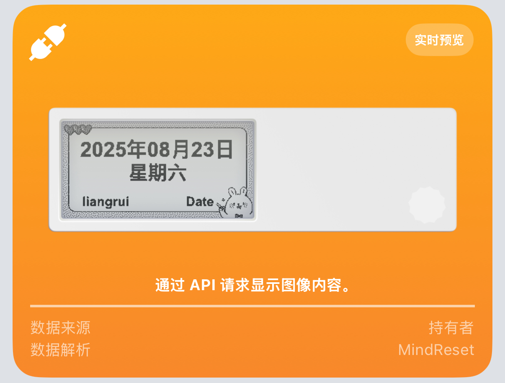
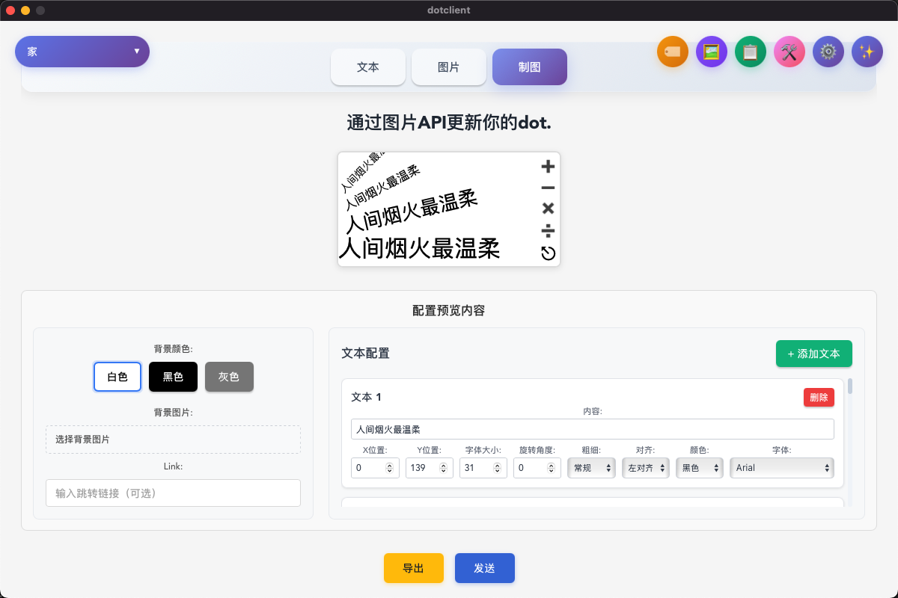

# DotClient客户端

针对Dot.开发的墨水屏推送软件，定制自己的文本和图案

  

## 主要功能

 - 调用dot.的文本、图片api配置内容，图片支持灰阶转换，让黑白墨水屏显示灰度的效果
 - 通过制图页面自由定制文本的样式，包括大小、旋转、emoji等
 - 配置的图片或者制作的图片，可以导出文件分享
 - 多个示例icon，示例图片可以选择
 - 配置多个设备，选择制定设备发送
 - 添加了base64转换工具，可以把图片转换成base64
 - 制图页面配置文件可以导出，可分享
 - 支持部本宏定义替换
 - 支持自动化任务，同样支持宏定义，建议任务之间大于5分钟

**示例图片**

  

## 软件示例

**支持自动化任务**

自动化任务配合文本宏替换功能可以自动生成日历，电脑状态等，在制图页面完成测试后可以导出配置，在任务是直接添加。

在是时间配置时，推荐用cron表达式配置时间，比如 `30 * * * * *` 表示每分钟的第10秒，`10 * * * *`表示每小时的第10分钟

  

注意事项：

 - 在更新任务时，如果任务列表没有刷新，尝试手动删除任务列表，再重新更新
 - 建议任务时间配置5分钟以上，刷新不要太频繁。
 - 如果你还有其他卡片，建议间隔更长的时间，防止图片api立即更新导致其他卡片被刷掉
 - 需要保持软件常驻，关掉软件后，任务会停止。重启之后需要点击到自动化页面触发任务更新。
 - 修改玩自动化任务后，建议切换到省电模式，减少软件渲染消耗电脑的电量

**制图页面示例**

  

**说明**

文本更新文本api，图片和制图更新图片api，需要在dot.手机app中查看添加的api状态

添加的设备信息在dot.手机app上查找，如果有问题可查看官网文档

官网链接 -> https://dot.mindreset.tech

**安装**

目前支持window，mac(apple, intel)版本

安装方式查看relase的页面，最新版本0.2.0

## 项目架构

Tauri + React + Typescript
